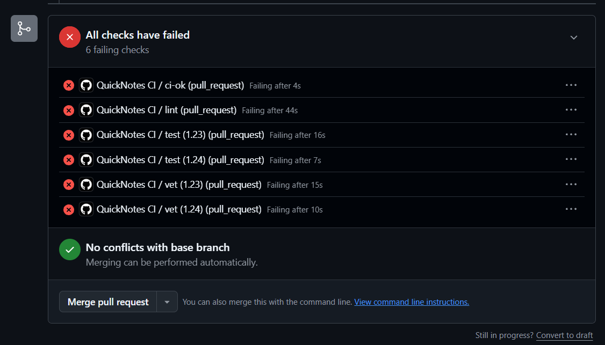
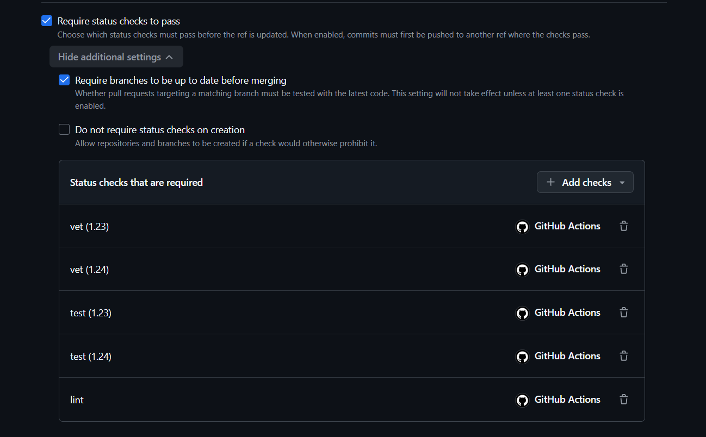

## Path

**GitHub Actions** — I chose it because my repository is hosted on GitHub and I can use GitHub Actions directly for CI and PR protection.

## Green CI run
[https://github.com/AyazN/DevOps-Intro/actions/runs/35265372253]

## Failed run

Fix commit:
[https://github.com/AyazN/DevOps-Intro/commit/b7955a8d3b1dc474f90d70a534e1022a4ae73ba4]
`test(lab3): restore passing test`

## Branch protection

## Design Questions

### a)
Pinning `ubuntu-24.04` makes the runner environment predictable. `ubuntu-latest` can change versions and break the pipeline unexpectedly.

### b)
Separate jobs run independently and in parallel, making failures easier to identify. A combined job can stop at the first failure.

### c)
SHA pinning protects against a compromised or modified action being silently delivered through a mutable tag. The relevant incident was the March 2025 `tj-actions/changed-files` supply-chain compromise.

### d)
`permissions:` controls the `GITHUB_TOKEN` permissions. `contents: read` follows the principle of least privilege.

### e)
A stage controls execution order/grouping. A job is an individual unit of work. `dependencies:` controls which previous-job artifacts are downloaded; `stages:` does not.

## Task 2 — Make It Fast and Smart

### Timing

| Scenario                                               | Wall-clock |
| ------------------------------------------------------ | ---------: |
| Baseline (no cache, single Go version, no path filter) |       29 s |
| With cache                                             |       31 s |
| With cache + matrix                                    |       45 s |

### Optimizations

* **Go dependency caching:** enabled caching through `setup-go`, keyed from the Go module files.
* **Go version matrix:** `vet` and `test` run against Go 1.23 and 1.24 in parallel.
* **Path filtering:** CI runs only when `app/` or the CI workflow changes, avoiding unnecessary runs for unrelated documentation changes.
* **Fail-fast disabled:** matrix jobs continue running even if another matrix cell fails.

### f) Why cache `go.sum`-keyed inputs and not build outputs?

Dependency inputs are deterministic and change when dependencies change, so they can be safely reused. Build outputs can depend on the operating system, Go version, source code, and build environment, so caching them can produce stale or incompatible results.

### g) What does `fail-fast: false` change?

With `fail-fast: false`, all matrix jobs continue running when one job fails, so the results of every Go version are visible. `fail-fast: true` is useful when the remaining matrix jobs provide little additional information and stopping them saves CI resources.

### h) What's the cache poisoning risk?

A malicious workflow could place attacker-controlled files into a cache, and a later trusted workflow could restore and execute those files. GitHub mitigates this with cache scope restrictions: caches created by `pull_request` runs are scoped to the pull-request merge ref, while low-trust workflows generally have read-only access to the default branch's cache scope.
