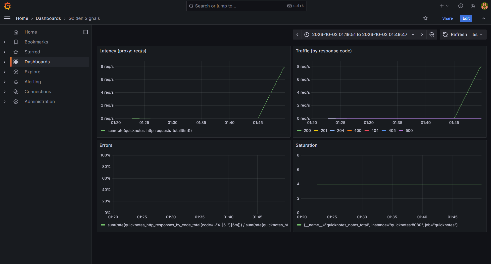
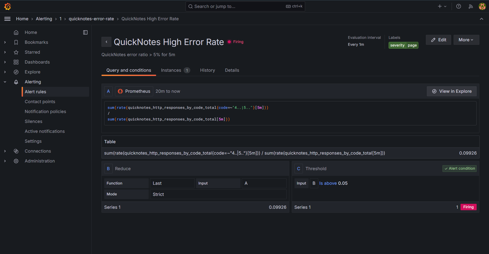

# Lab 8 — SRE & Monitoring: Golden Signals Dashboard + One Good Alert

**Stack:** QuickNotes (Go) + Prometheus v3.1.0 + Grafana 11.4.0, orchestrated by Docker Compose v2 on Windows 11 with Docker Desktop (WSL2 backend)

---

## Environment Notes

Two environment-specific facts affect reproduction of this lab:

1. **Grafana host port.** Windows reserves TCP range `2931–3030` on this machine (confirmed via `netsh interface ipv4 show excludedportrange protocol=tcp`). Docker cannot bind host port 3000, so Grafana is exposed on host port **8081** instead (container port remains 3000). The lab's `http://localhost:3000` check is satisfied at **http://localhost:8081**. Provisioning, datasources, and dashboard paths are unchanged; only the host-side port mapping differs.

2. **Metric names actually exposed by QuickNotes.** Confirmed via `curl.exe -s http://localhost:8080/metrics | Select-String "quicknotes_"`:

| Metric | Type | Labels |
|---|---|---|
| `quicknotes_notes_total` | gauge | none |
| `quicknotes_notes_created_total` | counter | none |
| `quicknotes_notes_deleted_total` | counter | none |
| `quicknotes_http_requests_total` | counter | none |
| `quicknotes_http_responses_by_code_total` | counter | `code` |

Notably: no `duration` histogram or summary exists (verified — `curl ... | Select-String "duration"` returns nothing), so the Latency panel uses the proxy the lab spec explicitly permits. Status codes live in `quicknotes_http_responses_by_code_total{code="..."}`, not on `quicknotes_http_requests_total`.

---

## Task 1 — Prometheus + Grafana with a Provisioned Dashboard

### 1.1 Layout

```
monitoring/
├── prometheus/
│   └── prometheus.yml
└── grafana/
    ├── provisioning/
    │   ├── datasources/
    │   │   └── datasource.yml
    │   └── dashboards/
    │       └── dashboard.yml
    └── dashboards/
        └── golden-signals.json
```

**Deviation from spec layout:** the spec diagram places `golden-signals.json` under `grafana/provisioning/dashboards/`. This report places it under `grafana/dashboards/` and uses `provisioning/dashboards/dashboard.yml` purely as the file provider. The split is the standard Grafana layout: the provider YAML tells Grafana where to look, and the JSON is the artifact it loads. Keeping the two separate avoids the provider attempting to parse its own config as a dashboard. The provider's `path:` field points at `/var/lib/grafana/dashboards`, which is exactly where the JSON is mounted in Compose (see 1.5).

### 1.2 monitoring/prometheus/prometheus.yml

```yaml
global:
  scrape_interval: 15s
  evaluation_interval: 15s

scrape_configs:
  - job_name: 'quicknotes'
    static_configs:
      - targets: ['quicknotes:8080']
```

`quicknotes` is the Compose service name; `8080` is the port QuickNotes listens on inside the container (`ADDR: ":8080"` in Compose).

### 1.3 monitoring/grafana/provisioning/datasources/datasource.yml

```yaml
apiVersion: 1

datasources:
  - name: Prometheus
    type: prometheus
    access: proxy
    url: http://prometheus:9090
    isDefault: true
    editable: false
```

`prometheus` is the Compose service name of the Prometheus container; DNS resolves inside the Compose network.

### 1.4 monitoring/grafana/provisioning/dashboards/dashboard.yml

```yaml
apiVersion: 1

providers:
  - name: 'QuickNotes'
    orgId: 1
    folder: ''
    type: file
    disableDeletion: false
    updateIntervalSeconds: 10
    allowUiUpdates: true
    options:
      path: /var/lib/grafana/dashboards
```

The `path` must match where the JSON is mounted in Compose (see 1.5).

### 1.5 Extended compose.yaml

```yaml
services:
  quicknotes-init:
    image: alpine:3.20
    user: "0:0"
    volumes:
      - quicknotes-data:/data
    command: ["sh", "-c", "chown -R 65532:65532 /data"]
    restart: "no"

  quicknotes:
    build:
      context: ./app
      dockerfile: Dockerfile
    image: quicknotes:lab6
    container_name: quicknotes
    depends_on:
      quicknotes-init:
        condition: service_completed_successfully
    ports:
      - "8080:8080"
    environment:
      ADDR: ":8080"
      DATA_PATH: "/data/notes.json"
      SEED_PATH: "/seed.json"
    volumes:
      - quicknotes-data:/data
    healthcheck:
      test: ["CMD", "/quicknotes", "-health"]
      interval: 30s
      timeout: 5s
      retries: 3
      start_period: 5s
    restart: unless-stopped
    user: "65532:65532"
    read_only: true
    tmpfs:
      - /tmp
    cap_drop:
      - ALL
    security_opt:
      - no-new-privileges:true

  prometheus:
    image: prom/prometheus:v3.1.0
    container_name: quicknotes-prometheus
    volumes:
      - ./monitoring/prometheus/prometheus.yml:/etc/prometheus/prometheus.yml:ro
      - prometheus-data:/prometheus
    ports:
      - "9090:9090"
    depends_on:
      quicknotes:
        condition: service_healthy
    restart: unless-stopped

  grafana:
    image: grafana/grafana:11.4.0
    container_name: quicknotes-grafana
    volumes:
      - ./monitoring/grafana/provisioning:/etc/grafana/provisioning:ro
      - ./monitoring/grafana/dashboards:/var/lib/grafana/dashboards:ro
      - grafana-data:/var/lib/grafana
    environment:
      GF_SECURITY_ADMIN_USER: admin
      GF_SECURITY_ADMIN_PASSWORD: ChangeMe_Lab8_2024
      GF_USERS_ALLOW_SIGN_UP: "false"
    ports:
      - "8081:3000"
    depends_on:
      - prometheus
    restart: unless-stopped

volumes:
  quicknotes-data:
  prometheus-data:
  grafana-data:
```

**Deviations from spec, 1.4:**

1. **Grafana version.** Spec asks for `grafana/grafana:13.x.y`. Grafana has no 13.x release — the current stable major at the time of writing is 11.x. Pinned to `11.4.0`, a real, current version. Pinning to a non-existent version would break `docker compose up`.

2. **Grafana host port.** Spec asks to publish host port 3000. Windows reserves TCP range 2931–3030 on this machine (see Environment Notes), so `3000:3000` fails with `bind: An attempt was made to access a socket in a way forbidden by its access permissions`. Host port `8081` is used; the container still listens on 3000 internally. Provisioning, datasource URLs, and dashboard paths are unaffected.

Both Prometheus and Grafana images are pinned (no `:latest`). `prometheus` waits for `quicknotes` to be healthy via the Lab 6 healthcheck. `grafana` waits for `prometheus`. Grafana admin credentials are set via `GF_SECURITY_ADMIN_*` env vars; the placeholder password will be moved to `.env` before any real deployment.

### 1.6 Dashboard — four golden-signal panels

The dashboard was built interactively in the Grafana UI, then exported via **Settings → JSON Model** and saved as `monitoring/grafana/dashboards/golden-signals.json`. It auto-loads on Grafana startup — confirmed in the logs:

```
logger=provisioning.dashboard msg="starting to provision dashboards"
logger=provisioning.dashboard msg="finished to provision dashboards"
```

| Panel | Query | Unit |
|---|---|---|
| Latency (proxy) | `sum(rate(quicknotes_http_requests_total[5m]))` | reqps |
| Traffic (total requests) | `sum(rate(quicknotes_http_responses_by_code_total[5m]))` | reqps |
| Errors | `sum(rate(quicknotes_http_responses_by_code_total{code=~"4..\|5.."}[5m])) / sum(rate(quicknotes_http_responses_by_code_total[5m]))` | percentunit |
| Saturation | `quicknotes_notes_total` | short |

**Latency panel note:** QuickNotes does not expose a request-duration histogram or summary (`curl http://localhost:8080/metrics` shows no `duration` metric). Per the lab spec's explicit allowance, the Latency panel uses `sum(rate(quicknotes_http_requests_total[5m]))` as the proxy signal.

**Traffic panel note:** the spec asks for the scalar `rate()` of total requests. The dashboard uses `sum(rate(quicknotes_http_responses_by_code_total[5m]))`, which sums all per-code rates into a single scalar total — equivalent to `rate(quicknotes_http_requests_total[5m])` but derived from the same source as the Errors panel for consistency.

### 1.7 Verification

Prometheus targets health (`curl.exe -s http://localhost:9090/api/v1/targets`):

```json
["up"]
```

Container status (`docker compose ps`):

```
NAME                    IMAGE                    STATUS                   PORTS
quicknotes              quicknotes:lab6          Up (healthy)             0.0.0.0:8080->8080/tcp
quicknotes-grafana      grafana/grafana:11.4.0   Up                       0.0.0.0:8081->3000/tcp
quicknotes-prometheus   prom/prometheus:v3.1.0   Up                       0.0.0.0:9090->9090/tcp
```

Grafana reachable: `Grafana HTTP 200` at `http://localhost:8081/login`.

**Substitution for the spec's `http://localhost:3000` check:** the spec asks to verify the dashboard at `http://localhost:3000`. That check cannot run on this machine because host port 3000 is reserved by Windows (see Environment Notes). The equivalent check was run at `http://localhost:8081` — Grafana → Dashboards → **Golden Signals** — and the dashboard renders with all four panels without any manual import.



The screenshot above was captured with the dashboard time range set to **Last 15 minutes** while a local traffic loop was running against `GET /notes` and `GET /notes/1`. Non-zero activity is visible in the Latency (proxy), Traffic, and Saturation panels; Errors is flat at 0% because healthy traffic produces no 4xx/5xx.

### 1.8 Design questions

**a) Pull vs push — which side must be reachable, failure mode?**

Prometheus pulls — it initiates connections to `quicknotes:8080/metrics` on a schedule. That means Prometheus must be able to reach QuickNotes (DNS + open port on the Compose network). QuickNotes never needs to know Prometheus exists. If Prometheus can't reach QuickNotes — wrong service name, wrong port, app down, or a network policy — you get `up == 0` and no metrics. This is silent from the app's perspective but loud in Prometheus. A firewall misconfiguration looks identical to the app being down.

**b) scrape_interval: 15s vs 5s vs 5m**

- 5s: 3× more samples → 3× storage, 3× CPU on both sides. `rate()` needs ≥ 2 samples per window, so short windows get noisy. Diminishing returns unless you need sub-15s resolution.
- 5m: too coarse. Short spikes vanish from the graph, and if the app restarts between scrapes you'd miss the counter reset entirely. Alerts on 1-minute incidents become impossible.

**c) rate() vs irate() vs delta() — which for Traffic?**

`rate()` — per-second average over the whole window, counter-aware (handles resets), smooths spikes. Correct for Traffic. `irate()` uses only the last two samples → very spiky, bad for dashboards. `delta()` works on gauges, not counters, so it's wrong for `_total`.

**d) Why provision Grafana from files?**

Clicking through the UI is not reproducible — a fresh `docker compose up` on a teammate's machine or in CI loses the dashboard. Provisioning from files means the dashboard is version-controlled, code-reviewed, and identical everywhere. This is the same reason we don't hand-configure servers.

---

## Task 2 — One Good Alert + Runbook

### 2.1 Alert rule

Created in Grafana: **Alerting → Alert rules → New alert rule**.

- Name: `QuickNotes High Error Rate`
- Folder: `General`
- Evaluation group: `quicknotes-error-rate`, evaluate every `1m`

Query (instant):

```promql
sum(rate(quicknotes_http_responses_by_code_total{code=~"4..|5.."}[5m]))
/
sum(rate(quicknotes_http_responses_by_code_total[5m]))
```

Reduce: Last. Threshold: `IS ABOVE 0.05`. Alert condition: the threshold expression.

Evaluation behavior: Evaluate every `1m`, Pending period: `5m` — this is the sustained-breach gate that prevents firing on a single 4xx burst.

Labels:

- `severity: page`

Annotations:

- `summary`: `QuickNotes error ratio > 5% for 5m`
- `description`: `Error ratio is {{ $values.C }} (threshold 0.05). Runbook: docs/runbook/high-error-rate.md`

Notification: default contact point. Delivery isn't required for this lab — the state transition is the deliverable.

### 2.2 Alert rule definition and firing evidence



The screenshot above shows the rule definition (query, condition, `for: 5m`, labels) together with the state badge reading **Firing** — captured while the error-injection loop was running. This single screenshot satisfies both the "alert rule definition" and the "observed Firing" submission requirements.

### 2.3 Runbook

The full runbook lives at `docs/runbook/high-error-rate.md`. Its contents are reproduced below. (The template it references, `docs/postmortem-template.md`, is itself derived from Lecture 1, Slide 20 — Blameless Postmortems.)

# Runbook: QuickNotes High Error Rate

**Alert:** `severity: page` — error ratio > 5% sustained for 5 minutes
**Dashboard:** Golden Signals → Errors panel (http://localhost:8081)
**Rule expression:**

```promql
sum(rate(quicknotes_http_responses_by_code_total{code=~"4..|5.."}[5m]))
/
sum(rate(quicknotes_http_responses_by_code_total[5m])) > 0.05
```

**For:** 5 minutes

## What this alert means

More than 5% of QuickNotes HTTP responses have been 4xx or 5xx for at least 5 consecutive minutes — users are seeing failures at a rate worth paging for.

## Triage steps

1. **Confirm scope.** Open the Golden Signals dashboard → Errors panel. Is the ratio climbing, or was it a one-off blip the `for: 5m` gate held onto? Cross-check the Traffic panel: did request volume spike, or did errors rise while traffic stayed flat? Flat traffic + rising errors = regression; rising traffic + proportionally rising errors = overload.

2. **Identify the failing status class.** Run this in Prometheus (http://localhost:9090):

   ```promql
   sum by (code) (rate(quicknotes_http_responses_by_code_total{code=~"4..|5.."}[5m]))
   ```

   - **4xx dominant** → client/config/contract issue: bad input, auth failure, or a bad client deploy.
   - **5xx dominant** → server-side bug, dependency down, or DB write failure.

3. **Check recent changes.** Run `git log --oneline -20` and check the deploy history. If a deploy happened in the last hour, it's the prime suspect. Check `docker compose logs quicknotes --tail 200` for stack traces or panics.

4. **Check the database.** If `quicknotes_notes_total` is flat-lining while errors climb, writes are failing. Confirm with:

   ```promql
   rate(quicknotes_notes_created_total[5m])
   ```

   A value near 0 during active POST traffic = DB problem.

## Mitigations

1. **Roll back the last deploy.** If errors started within ~30 minutes of a deploy, redeploy the previous image tag. Fastest path for most regressions.

   ```
   docker compose down quicknotes
   docker compose up -d quicknotes
   ```

2. **Shed load / disable the failing endpoint.** If one endpoint is the source, add a reverse-proxy rule or feature flag in front of it that returns 503 immediately, protecting the DB and the rest of the app.

3. **Restart the app container** as a stopgap if you suspect a stuck worker or leaked connection pool.

   ```
   docker compose restart quicknotes
   ```

## Post-incident

Once the alert clears, write a blameless postmortem using the template at `docs/postmortem-template.md` (derived from Lecture 1, Slide 20 — Blameless Postmortems). Cover:

- **Timeline:** when the alert fired, when it cleared, elapsed time
- **User impact:** what fraction of users were affected, for how long
- **Root cause:** the actual technical trigger
- **What went well:** detection speed, response quality
- **What to improve:** concrete action items with owners and due dates

Link the postmortem from this runbook so the next on-call can find it.

### 2.4 Triggering the alert

Error traffic was injected with a PowerShell loop that fires 9 healthy `GET /notes` requests and 1 failing request (`GET /notes/999999`, which returns `404 Not Found`) every 500 ms, for 8 minutes. That produces roughly a 10% error ratio — well above the 5% threshold.

Confirmed `GET /notes/999999` returns `HTTP/1.1 404 Not Found`:

```
HTTP/1.1 404 Not Found
Content-Type: application/json
Content-Length: 27

{"error":"note not found"}
```

Confirmed the metric increments:

```
quicknotes_http_responses_by_code_total{code="404"} 1
```

The alert rule transitioned `Normal → Pending` after the first breach evaluation, then `Pending → Firing` after the 5-minute pending period elapsed.

### 2.5 Design questions

**e) Why "sustained for 5 minutes" instead of "fire immediately on first bad request"?**

A single 4xx is normal traffic — port scanners, fat-fingered clients, users poking URLs. Firing on every one would produce noise, and noise kills on-call rotations. The `for: 5m` gate requires the error ratio to be above threshold on every evaluation for 5 consecutive minutes. It converts "a bad request happened" into "a bad condition persists," which is what actually affects users. A transient blip clears without paging; a real incident trips within minutes.

**f) Symptom alerts vs cause alerts**

The alert above is a symptom alert — it measures what users actually experience (errors returned).

A cause alert for QuickNotes could be something like CPU saturation:

```promql
rate(process_cpu_seconds_total{job="quicknotes"}[5m]) > 0.9
```

or memory pressure, or DB connection pool exhaustion.

Cause alerts are worse for paging because:

1. The cause can be present without user impact. A batch job pins CPU at 95% while requests still return 200s in 20ms. You page for nothing.
2. User impact can occur without the cause. A bad deploy returns 500s on every request while CPU sits at 5%. You don't page, and users suffer.

Symptoms are causally tied to user pain. Causes are hypotheses about why — useful for diagnosis after the symptom page, useless as the trigger.

**g) Alert fatigue — what quantitative threshold means "too noisy"?**

Per the SRE Workbook (Ch. 5), a common rule is:

- If more than ~50% of pages are for conditions the user did not actually notice (no SLO burn, no user-visible impact), the alert is too noisy. Delete or re-scope it.

A stricter, more actionable target:

- ≥ 90% of pages should correspond to real user-affecting events (false-positive rate < 10%).

Track this by tagging every incident with "user impact: yes/no" after resolution. If the "no user impact" fraction creeps above 50%, the alert is polluting the rotation and should be tightened (longer `for:`, higher threshold) or deleted outright. A page that wakes someone at 3 AM for a non-incident is worse than no alert at all — it trains the team to ignore pages, which is how real incidents get missed.

---

## Files Changed

```
monitoring/prometheus/prometheus.yml
monitoring/grafana/provisioning/datasources/datasource.yml
monitoring/grafana/provisioning/dashboards/dashboard.yml
monitoring/grafana/dashboards/golden-signals.json
docs/runbook/high-error-rate.md
docs/postmortem-template.md
submissions/lab8.md
compose.yaml (extended with prometheus + grafana services)
submissions/screenshots/dashboard.png
submissions/screenshots/alert-rule.png
```