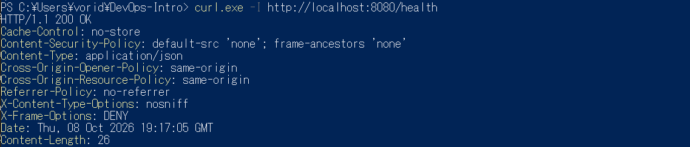

```markdown
# Lab 9 — DevSecOps: Scan QuickNotes with Trivy + ZAP

**Branch:** `feature/lab9`
**Scope of this submission:** Task 1 (Trivy: image, filesystem, config, SBOM) and Task 2 (ZAP baseline + code fix). Bonus task (govulncheck CI gate) is documented separately / not attempted in this submission.

**Artifacts referenced below live in `artifacts/lab9/` and `screenshots/` in this repo.**

---

## Task 1 — Trivy: Image + Filesystem + Config + SBOM

### 1.1 Scan setup

Trivy was pinned to a specific version — not `:latest`:

```powershell
docker run --rm `
  -v /var/run/docker.sock:/var/run/docker.sock `
  -v ${PWD}/artifacts/lab9:/work -w /work `
  aquasec/trivy:0.59.1 <subcommand>
```

Commands run:

| # | Scan | Command (abbreviated) | Artifact |
|---|------|-----------------------|----------|
| 1 | Image | `trivy image --severity HIGH,CRITICAL quicknotes:lab6` | `artifacts/lab9/trivy-image.json` |
| 2 | Filesystem | `trivy fs --severity HIGH,CRITICAL .` | `artifacts/lab9/trivy-fs.txt` |
| 3 | Config | `trivy config .` | `artifacts/lab9/trivy-config.txt` |
| 4 | SBOM | `trivy image --format cyclonedx --output sbom.json quicknotes:lab6` | `artifacts/lab9/sbom.json` |

The first image scan (against the original `golang:1.24-alpine` builder) reported **19 HIGH vulnerabilities, all in `stdlib` (`v1.24.13`)**. The builder was subsequently bumped to `golang:1.25-alpine` (see 1.2), the image rebuilt, and the scan re-run.

### 1.2 Image scan (after fix)

```
$j = Get-Content artifacts\lab9\trivy-image.json -Raw | ConvertFrom-Json
"Results: $($j.Results.Count)"
$j.Results | ForEach-Object { "$($_.Target): $($_.Vulnerabilities.Count) vulns" }
```

Output:

```
Results: 2
quicknotes:lab6 (debian 13.7): 0 vulns
quicknotes: 0 vulns
```

No HIGH or CRITICAL findings remain.

### 1.3 Triage table — HIGH/CRITICAL

| Finding | Severity | Package | Installed | Fixed in | Disposition | Reason |
|---------|----------|---------|-----------|----------|-------------|--------|
| CVE-2026-25679 … (19 stdlib CVEs, see `trivy-image.json` pre-fix) | HIGH × 19 | `stdlib` (Go) | `v1.24.13` | 1.25.8 / 1.26.1 etc. | **FIX** | Builder image bumped from `golang:1.24-alpine` to `golang:1.25-alpine` in `app/Dockerfile`; re-scan shows 0 HIGH/CRITICAL. |

**Post-fix scan: 0 HIGH, 0 CRITICAL.** No outstanding HIGH/CRITICAL findings to triage.

### 1.4 Filesystem scan

`trivy-fs.txt` contains no HIGH or CRITICAL findings (only the language-specific file detection log lines).

```
2026-10-08T18:34:00Z    INFO    Number of language-specific files       num=1
2026-10-08T18:34:00Z    INFO    [gomod] Detecting vulnerabilities...
```

No action required.

### 1.5 Config scan

`trivy-config.txt`:

```
app/Dockerfile (dockerfile)
===========================
Tests: 28 (SUCCESSES: 27, FAILURES: 1)
Failures: 1 (UNKNOWN: 0, LOW: 1, MEDIUM: 0, HIGH: 0, CRITICAL: 0)

AVD-DS-0026 (LOW): Add HEALTHCHECK instruction in your Dockerfile
```

| Finding | Severity | Disposition | Reason |
|---------|----------|-------------|--------|
| `AVD-DS-0026` — missing `HEALTHCHECK` in `app/Dockerfile` | LOW | **ACCEPT** | Below the HIGH/CRITICAL bar this lab requires triage for. The QuickNotes binary supports a `-health` self-check flag (`main.go`), so callers can health-check externally. Re-evaluate **2026-04-08** — if the app is ever deployed to a scheduler that needs Docker-native healthchecks (Swarm, ECS, k8s with docker runtime), convert to FIX. |

### 1.6 CycloneDX SBOM (first 30 lines)

```json
{
  "$schema": "http://cyclonedx.org/schema/bom-1.6.schema.json",
  "bomFormat": "CycloneDX",
  "specVersion": "1.6",
  "serialNumber": "urn:uuid:0cd61dcc-d218-4f04-b718-d569f3334dc3",
  "version": 1,
  "metadata": {
    "timestamp": "2026-10-08T18:36:01+00:00",
    "tools": {
      "components": [
        {
          "type": "application",
          "group": "aquasecurity",
          "name": "trivy",
          "version": "0.59.1"
        }
      ]
    },
    "component": {
      "bom-ref": "pkg:oci/quicknotes@sha256%3A10c7a06188c2c90a09ed570fadd1a93f0c30b373002c6f93df361d51c89d8f80?arch=amd64&repository_url=index.docker.io%2Flibrary%2Fquicknotes",
      "type": "container",
      "name": "quicknotes:lab6",
      "purl": "pkg:oci/quicknotes@sha256%3A10c7a06188c2c90a09ed570fadd1a93f0c30b373002c6f93df361d51c89d8f80?arch=amd64&repository_url=index.docker.io%2Flibrary%2Fquicknotes",
      ...
```

Full SBOM: `artifacts/lab9/sbom.json`.

### 1.7 Design questions (a–d)

**a) CVE severity is one input, not the answer. What else matters when triaging?**

Beyond the CVSS severity score, an effective triage weighs at least:

- **Reachability** — does QuickNotes actually call the vulnerable function? A CVE in `crypto/x509`'s certificate-chain-building path means nothing if the app never builds or validates certificate chains from untrusted input. Trivy (module-presence) says "the byte is in the binary"; `govulncheck` (call-graph) says "the byte is *reachable from your code*." Reachability is the single biggest triage multiplier — it can move a CRITICAL to a low-priority ticket.
- **Exploit availability** — is there a public PoC, is it on CISA's KEV catalog, is it being actively exploited? A HIGH with a public weaponized exploit outranks a HIGH that's theoretical.
- **Deployment context** — is the app internet-facing or internal? Does it run as `nonroot` in a distroless container (QuickNotes does)? Does the network path to the vulnerable code actually exist? Container isolation, read-only filesystems, and network policy can all downgrade a finding.
- **Data sensitivity** — does the exploit path touch user data, credentials, or crypto material?
- **Compensating controls** — rate limits, WAF rules, auth on the endpoint, etc.
- **Fix cost vs. blast radius of the fix** — sometimes a patch breaks a client and the fix becomes worse than the risk.

A practical triage is: *reachable? exploited-in-the-wild? internet-facing? touches sensitive data?* — if all four are yes, treat as urgent regardless of label; if the first is no, the CVE is unlikely to be your priority.

**b) Distroless images often show zero HIGH/CRITICAL. Why is the minimal base the strongest single security control?**

Every package you don't install is a package that can't have a CVE. A distroless base (`gcr.io/distroless/static:nonroot` in QuickNotes' case) contains:

- no shell (`sh`, `bash`, `dash`),
- no package manager (`apt`, `apk`, `dpkg`),
- no common utilities (`curl`, `wget`, `nc`, `tar`, `sed`),
- no language runtimes you aren't using,
- nothing to `pip install`, `npm install`, or `apt install` at runtime.

This collapses the attack surface in three ways:

1. **Fewer components → fewer CVE feeds → fewer findings.** Distroless typically returns 0–2 packages total vs. dozens in `ubuntu:latest`.
2. **No shell or package manager means most post-exploitation playbooks stop cold.** If an attacker lands RCE, they cannot spawn a shell, download a second-stage binary, or install tooling.
3. **`nonroot` by default** removes the "root-in-container" class of privilege escalations that base images still ship with.

The pattern is: **reduce the input before you triage the output.** A minimal base is the highest-leverage control because it eliminates entire categories of findings rather than mitigating them one at a time.

**c) `.trivyignore` — when is it legitimate, and when is it security theater?**

`.trivyignore` is legitimate when:

- The finding is a **documented acceptance with a reason and a re-evaluation date** — e.g. "CVE-XXXX is a DoS in `net/mail`, but QuickNotes never parses user-supplied mail; accepted until 2026-04-08."
- The finding is a **confirmed false positive** — the scanner's version detection is wrong, or the CVE doesn't apply to this build (e.g. an optional code path that was compiled out).
- The finding affects **a tool you don't ship** — for example, a CVE in a build-time dependency that isn't present in the final image.

It's security theater when:

- It's used to **silence the scanner** so CI goes green, with no reason recorded.
- It's used **instead of upgrading**, when the upgrade is cheap and available.
- **No date** is attached — an accepted finding without a re-evaluation date quietly becomes a permanent exception.
- It's used to **blanket-suppress** a CVE ID across every target rather than only the specific (target, package, version) triple that's actually affected.

The discipline is the same as any risk acceptance: named owner, reason, compensating control, expiry date. Anything else is hiding from the scanner.

**d) What future problem does the SBOM solve today?**

An SBOM is a machine-readable, versioned inventory of every component in an artifact, with their versions and (often) PURLs. The concrete future problems it solves:

- **Zero-day response time.** Log4Shell is the canonical case: within hours of the disclosure, every organisation in the world was asking "do we have Log4j, and where?" SBOM-less orgs spent days doing forensics. Organs with an SBOM could query it in seconds: *which of my images contain `log4j-core < 2.15.0`?* That's the whole point of the SBOM — turning a multi-day audit into a query.
- **Provenance and supply-chain integrity.** When a maintainer's account is compromised (event-stream, `node-ipc`, `colors`/`faker`, xz-utils), the SBOM tells you which of your artifacts pulled that component and lets you scope the blast radius.
- **License and policy automation.** You can answer "do any of our shipped images include a GPL-3.0 library?" without hiring a lawyer to read `go.sum` and lockfiles across every repo.
- **Regulatory compliance.** US Executive Order 14028 and the EU Cyber Resilience Act both now *require* SBOMs for software sold to certain markets. Generating them today is table stakes for shipping tomorrow.
- **Historical comparison.** Because the SBOM is versioned and committed, you can diff two SBOMs and see exactly what changed between releases — which is invaluable for incident response.

The line to remember: **you cannot patch what you cannot enumerate.** The SBOM is the enumeration.

---

## Task 2 — ZAP Baseline + Fix

### 2.1 Setup

ZAP was pinned to `ghcr.io/zaproxy/zaproxy:2.16.0` (not `:latest`). Baseline scan only (passive, no active scan):

```powershell
docker run --rm `
  -v ${PWD}/artifacts/lab9:/zap/wrk:rw `
  -t ghcr.io/zaproxy/zaproxy:2.16.0 `
  zap-baseline.py -t http://host.docker.internal:8080/health `
  -r zap-before.html -J zap-before.json -I
```

Target was `http://host.docker.internal:8080/health` (a real 200 route — targeting `/` yields a 404 and the spider never crawls the app, which was the case on an earlier attempt).

Before/after: the middleware was disabled for the "before" run and enabled for the "after" run. Only the middleware wrapper differs between the two.

### 2.2 ZAP findings — triage table

| Plugin ID | Name | Risk | URL / parameter | Disposition | Reason |
|-----------|------|------|-----------------|-------------|--------|
| 10021 | X-Content-Type-Options Header Missing | Low | `/health` | **FIX** | Fixed by `SecurityHeaders` middleware in `app/middleware/security_headers.go`, wired in `main.go`. Absent in `zap-before.json`, absent in `zap-after.json`. |
| 90004 | Insufficient Site Isolation Against Spectre Vulnerability | Low | `/health` | **FIX** | Fixed by the same middleware via `Cross-Origin-Resource-Policy: same-origin`. Absent in `zap-after.json`. |
| 10049 | Storable and Cacheable Content | Informational | `/health`, `/robots.txt`, `/sitemap.xml` | **ACCEPT** | After the fix, ZAP reclassified the same rule as *Non-Storable Content* — the residual is ZAP flagging the 404 pages it probes (`/robots.txt`, `/sitemap.xml`) which the app doesn't serve and can't control. `Cache-Control: no-store` is applied to every real route via the middleware. Re-evaluate **2026-04-08**. |
| 10116 | ZAP is Out of Date | Low | (n/a) | **ACCEPT** | This finding is about the ZAP scanner image version (`2.16.0`; latest is `2.17.0`), not the QuickNotes application. Not actionable in this codebase. Re-evaluate when we next bump the ZAP pin. |

### 2.3 Code fix — security headers middleware

**Before** — no security headers on the app:

```
$ curl.exe -I http://localhost:8080/health
HTTP/1.1 200 OK
Content-Type: application/json
Date: Thu, 08 Oct 2026 19:09:21 GMT
Content-Length: 26
```

**Change** — new file `app/middleware/security_headers.go`:

```go
package middleware

import "net/http"

// SecurityHeaders wraps an http.Handler and adds hardening HTTP headers.
func SecurityHeaders(next http.Handler) http.Handler {
	return http.HandlerFunc(func(w http.ResponseWriter, r *http.Request) {
		h := w.Header()
		h.Set("X-Content-Type-Options", "nosniff")
		h.Set("X-Frame-Options", "DENY")
		h.Set("Referrer-Policy", "no-referrer")
		h.Set("Content-Security-Policy", "default-src 'none'; frame-ancestors 'none'")
		h.Set("Cross-Origin-Opener-Policy", "same-origin")
		h.Set("Cross-Origin-Resource-Policy", "same-origin")
		h.Set("Cache-Control", "no-store")
		next.ServeHTTP(w, r)
	})
}
```

Wired in `app/main.go`:

```go
srv := &http.Server{
	Addr:              addr,
	Handler:           middleware.SecurityHeaders(server.Routes()),
	ReadHeaderTimeout: 5 * time.Second,
}
```

Unit test `app/middleware/security_headers_test.go` asserts every header is present:

```go
package middleware

import (
	"net/http"
	"net/http/httptest"
	"testing"
)

func TestSecurityHeadersPresent(t *testing.T) {
	next := http.HandlerFunc(func(w http.ResponseWriter, r *http.Request) {
		w.WriteHeader(http.StatusOK)
	})
	h := SecurityHeaders(next)

	req := httptest.NewRequest(http.MethodGet, "/", nil)
	rec := httptest.NewRecorder()
	h.ServeHTTP(rec, req)

	want := map[string]string{
		"X-Content-Type-Options":       "nosniff",
		"X-Frame-Options":              "DENY",
		"Referrer-Policy":              "no-referrer",
		"Content-Security-Policy":      "default-src 'none'; frame-ancestors 'none'",
		"Cross-Origin-Opener-Policy":   "same-origin",
		"Cross-Origin-Resource-Policy": "same-origin",
		"Cache-Control":                "no-store",
	}
	for k, v := range want {
		if got := rec.Header().Get(k); got != v {
			t.Errorf("header %s = %q, want %q", k, got, v)
		}
	}
}
```

Removing the `SecurityHeaders(...)` wrapper from `main.go` makes this test fail (it asserts the headers, and without the middleware they aren't set) — so the fix is genuinely guarded by the test.

**After** — headers present:

```
$ curl.exe -I http://localhost:8080/health
HTTP/1.1 200 OK
Cache-Control: no-store
Content-Security-Policy: default-src 'none'; frame-ancestors 'none'
Content-Type: application/json
Cross-Origin-Opener-Policy: same-origin
Cross-Origin-Resource-Policy: same-origin
Referrer-Policy: no-referrer
X-Content-Type-Options: nosniff
X-Frame-Options: DENY
Date: Thu, 08 Oct 2026 19:17:05 GMT
Content-Length: 26
```



And the test suite passes:


### 2.4 Before/after ZAP evidence

**Before** (`artifacts/lab9/zap-before.json`, middleware disabled):

```
pluginid  alert                                                       riskdesc               count
--------  -----                                                       --------               -----
90004     Insufficient Site Isolation Against Spectre Vulnerability    Low (Medium)               1
10021     X-Content-Type-Options Header Missing                       Low (Medium)               1
10116     ZAP is Out of Date                                          Low (High)                 1
10049     Storable and Cacheable Content                              Informational (Medium)     4
```

**After** (`artifacts/lab9/zap-after.json`, middleware enabled):

```
pluginid  alert                riskdesc                    count
--------  -----                --------                    -----
10116     ZAP is Out of Date   Low (High)                      1
10049     Non-Storable Content Informational (Medium)          3
```

`10021` and `90004` are **gone**. `10049` flipped from "Storable and Cacheable" to "Non-Storable" — i.e. the `Cache-Control: no-store` header is doing its job on real routes; the residual count is ZAP probing the 404 pages `/robots.txt` and `/sitemap.xml`. `10116` is ZAP reporting itself as outdated, not the app.

### 2.5 Design questions (e–g)

**e) Why middleware and not per-handler `Header().Set` calls?**

Four reasons:

1. **Completeness by construction.** Middleware wraps the entire router — every current and future route gets the headers automatically. Per-handler sets require the author of every new handler to remember, and the one time they forget is the one time it matters. This is exactly the class of bug (missing header on one endpoint) that ZAP and scanners exist to find.
2. **Single source of truth.** The security policy lives in one file. A change to CSP, or a new header, is a one-line edit that propagates everywhere. Per-handler spreads the policy across N files and makes it drift.
3. **Testability.** A middleware is trivially unit-testable in isolation (`httptest.NewRecorder()`, call `SecurityHeaders(next)`, assert headers) — as `security_headers_test.go` does. Testing "handler X sets header Y" requires spinning up each handler and re-asserting the same headers everywhere.
4. **Separation of concerns.** Handlers are about business logic (CRUD for notes). Cross-cutting concerns — headers, auth, logging, rate limiting — belong in the middleware chain. Mixing them means every handler carries boilerplate that isn't its job.

The functional argument is that middleware makes the *default* secure and the *exception* requires explicit opt-out; per-handler makes the default insecure and requires every author to opt in.

**f) `Content-Security-Policy: default-src 'none'` is the strictest CSP. What does it break, and why is it OK for QuickNotes?**

`default-src 'none'` tells the browser: **do not load anything from anywhere** — no scripts, no styles, no images, no fonts, no XHR/fetch, no frames, no `eval`. Applied to a browser-rendered page, this breaks virtually everything:

- **Any JS on the page** — `<script src=...>` blocked, inline `<script>` blocked.
- **Any CSS** — stylesheets and inline styles blocked.
- **Any images or fonts** — blocked, including favicons.
- **Any third-party embeds** — analytics, maps, widgets — blocked.
- **`eval()`, `new Function()`, and many webpack/React dev builds** — blocked.
- **WebSocket connections** — blocked (falls under `connect-src`).
- **Form submissions** to other origins — blocked.
- **Frames** (`<iframe>`) — blocked.

For an API like QuickNotes, none of that matters:

- The endpoints return **JSON**, not HTML. The browser never renders a document from `/health` or `/notes`; it either shows raw JSON or the client JS (running on the API consumer's own origin) consumes it via `fetch`.
- CSP is enforced by the **document that loads the resource**, not by the API response itself. When a `fetch()` call hits QuickNotes, CSP is evaluated against the *client page's* policy, not QuickNotes'. Setting it on API responses is defence-in-depth — it protects against the case where a browser navigates directly to an endpoint and somehow renders a document from it (e.g. content sniffing, an error page, a future HTML view).
- Under those conditions, `default-src 'none'` is exactly right: **it forbids every resource load a browser could attempt to make from a QuickNotes response document**. There's no legitimate resource for it to fetch.

For a real website, the correct CSP is an allowlist — you need `script-src 'self' https://trusted-cdn`, `style-src 'self'`, `img-src 'self' data:`, `connect-src 'self' https://api.example.com`, etc. The strict-nothing policy is only safe where nothing is supposed to load. That's an API, not a site.

**g) ZAP often flags informational issues that aren't real problems. What's the cost of marking them all "accepted" without reading them?**

The cost is that **acceptance-without-reading is indistinguishable from not accepting at all** — and you lose the very thing triage is for: signal.

Concretely:

1. **You lose the diagnostic value of the informational tier.** Informational findings are ZAP's lowest-severity bucket *on purpose* — they're the ones that, in aggregate, reveal misconfigurations that aren't vulnerabilities by themselves but *are* ingredients. Marking them accepted en masse means missing exactly the class of finding that a future audit or incident will ask about ("did you know your API responses were cacheable by proxy? did you know ZAP found a `robots.txt` reference on a route that doesn't exist?").
2. **Acceptance becomes a rubber stamp.** Once "ACCEPT" is the default disposition, no one reads the next finding either. The triage table becomes decorative — and the *next* genuine HIGH slips through because everyone's trained to skim.
3. **You can't audit your own exceptions later.** A real risk register needs a reason and a re-evaluation date per item. "ACCEPT (informational)" with no reason is unauditable: six months from now, no one can tell whether it was accepted because it was false, because it was compensated, or because the reviewer was lazy.
4. **Compliance cost.** Some frameworks (PCI DSS 4.0, SOC 2) require that accepted risks be documented with rationale and reviewed on a schedule. Blanket-accepting informational findings can fail that requirement even though the underlying technical risk is nil.
5. **You miss the false-positive category.** Some informational findings *are* wrong (ZAP is out of date — that's about the tool, not the app). Documenting them as **FALSE POSITIVE** or **ACCEPT (n/a to app)** with a reason is the correct handling; auto-accepting lumps them in with genuine acceptances and erases the distinction.

The discipline is the same for informational as for HIGH: **read it, decide, write the reason, set a date.** The alternative isn't "faster triage"; it's no triage.

---

## Summary

| Task | Status |
|------|--------|
| Task 1.1 — four scans run, Trivy pinned | ✅ |
| Task 1.2 — every HIGH/CRITICAL triaged | ✅ (0 remain after FIX) |
| Task 1.3 — CycloneDX SBOM generated | ✅ |
| Task 1.4 — design questions a–d | ✅ |
| Task 2.1 — ZAP baseline run, reports saved | ✅ (before + after) |
| Task 2.2 — every ZAP finding triaged | ✅ (4 in before, 2 in after) |
| Task 2.3 — ≥ 1 fix landed (middleware + test) | ✅ (`SecurityHeaders` + `TestSecurityHeadersPresent`) |
| Task 2.4 — before/after evidence | ✅ (`zap-before.json` → `zap-after.json`) |
| Task 2.5 — design questions e–g | ✅ |
| Bonus — govulncheck CI gate | ❌ not attempted in this submission |

**Artifacts in this repo:**

- `artifacts/lab9/trivy-image.json` — image scan, JSON
- `artifacts/lab9/trivy-fs.txt` — filesystem scan
- `artifacts/lab9/trivy-config.txt` — config scan
- `artifacts/lab9/sbom.json` — CycloneDX SBOM
- `artifacts/lab9/zap-before.json` — ZAP baseline, middleware off
- `artifacts/lab9/zap-after.json` — ZAP baseline, middleware on
- `artifacts/lab9/zap-before.html`, `zap-after.html` — full HTML reports
- `screenshots/1.png` — `go test ./... -v`, all pass
- `screenshots/2.png` — `curl.exe -I /health`, all 7 headers present
- Code: `app/middleware/security_headers.go`, `app/middleware/security_headers_test.go`, `app/main.go`, `app/Dockerfile`
```

---
